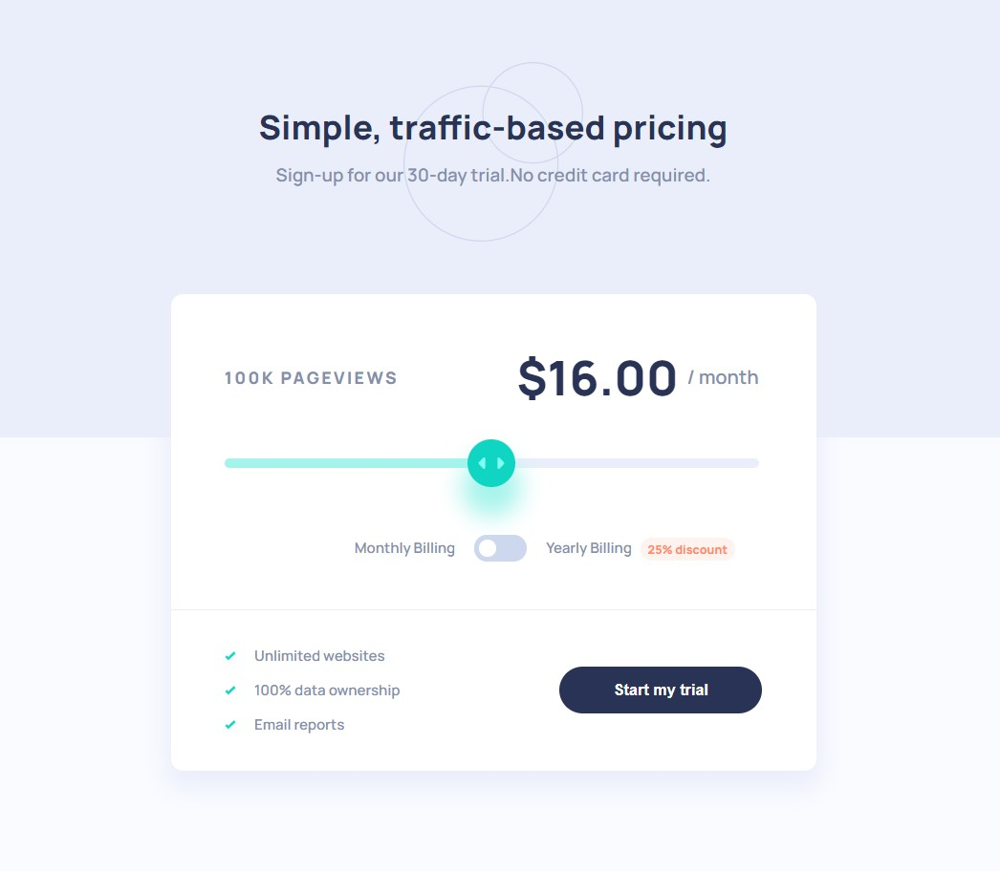

# Frontend Mentor - Interactive pricing component solution

This is a solution to the [Interactive pricing component challenge on Frontend Mentor](https://www.frontendmentor.io/challenges/interactive-pricing-component-t0m8PIyY8). Frontend Mentor challenges help you improve your coding skills by building realistic projects. 

## Table of contents

- [Overview](#overview)
  - [The challenge](#the-challenge)
  - [Screenshot](#screenshot)
  - [Links](#links)
- [My process](#my-process)
  - [Built with](#built-with)
  - [What I learned](#what-i-learned)
  - [Continued development](#continued-development)
  - [Useful resources](#useful-resources)
- [Author](#author)

## Overview

### The challenge

Users should be able to:

- View the optimal layout for the app depending on their device's screen size
- See hover states for all interactive elements on the page
- Use the slider and toggle to see prices for different page view numbers

### Screenshot



### Links

- Solution URL: [GitHub](https://github.com/Shcracoziabra/pricing-component)
- Live Site URL: [Netlify](https://shcraco-pricing-component.netlify.app)

## My process

### Built with

- Semantic HTML5 markup
- CSS custom properties
- Flexbox
- CSS Grid
- Vanilla JS

### What I learned

The component I created should show different page view ranges and the corresponding monthly price totals:

- 10K pageviews / $8 per month
- 50K pageviews / $12 per month
- 100K pageviews / $16 per month
- 500k pageviews / $24 per month
- 1M pageviews / $36 per month

It is possible to switch the toggle to yearly billing, in this case a 25% discount is applied to all prices.


In this challenge I learned to create a custom switch toggle element.

```html
<div class="pricing-card__switch-wrapper">
  <p class="pricing-card__billing">Monthly Billing</p>
  <input id="pricing-card__switch" class="pricing-card__switch" type="checkbox">
  <label for="pricing-card__switch"></label>
  <label for="pricing-card__switch" hidden>turn on year billing</label>
  <p id="discount" class="pricing-card__billing">
    Yearly Billing
  </p>
</div>
```
```css
.pricing-card__switch {
    width: 0;
    height: 0;
    opacity: 0;
}

.pricing-card__switch+label {
    margin: 0 16px;
    display: inline-block;
    position: relative;
    width: 44px;
    height: 22px;
    border-radius: 11px;
    background-color: var(--medium-grayish-blue);
    transition: .5s;
}

.pricing-card__switch+label::after {
    position: absolute;
    content: "";
    height: 100%;
    aspect-ratio: 1;
    background-color: var(--white);
    border-radius: 50%;
    border: 4px solid var(--medium-grayish-blue);
    transition: all .2s ease-in;
    left: 0;
}

.pricing-card__switch:checked+label::after {
    transform: translateX(22px);
}
```

Also making a custom range input was a completely new task for me, but I received a valuable experience.

### Continued development

It is still challenging to define proper widths, paddings ang margins. Also need to practise using Grid.

### Useful resources

- [Generate Custom Range Input](https://range-input-css.netlify.app/) - Here you can manipulate parameters of the track and thumb that comprise a range input, and watch the CSS code being changed dynamically.

- [Comprehensive Article On Styling Range Input](https://blog.logrocket.com/creating-custom-css-range-slider-javascript-upgrades/) - Every detail of styling range on different browsers.

- [Create Custom Range Slider](https://www.sitepoint.com/css-custom-range-slider/) - Custom range input with using `border-image` property to show progress.

- [Creating A Toggle Switch](https://www.w3schools.com/howto/howto_css_switch.asp) - Create custom on/off element by styling checkbox input.

- [Styling Outline](https://developer.mozilla.org/en-US/docs/Web/CSS/outline-offset) - How to make a custom outline.

## Author

- GitHub - [Tetiana B.](https://github.com/Shcracoziabra)
- Frontend Mentor - [@Shcracoziabra](https://www.frontendmentor.io/profile/Shcracoziabra)
